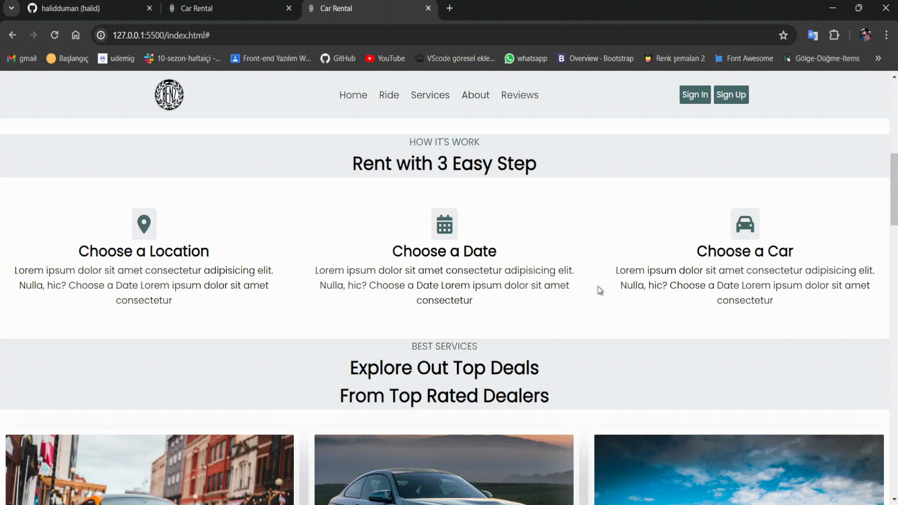

# Responsive Tasarımlı Web Sitesi Projesi

Bu proje, HTML ve CSS kullanarak responsive tasarıma sahip bir web sitesi oluşturmayı amaçlamaktadır.

## Gereksinimler

- Responsive Tasarım
- Logo
- Tasarım Rengi: Turkuaz
- Hover Efektleri
- Kaydırdıkça Takip Eden Navbar

## Teknolojiler

- HTML
- CSS

## Örnek Görüntüler

örnek:1

örnek:2

